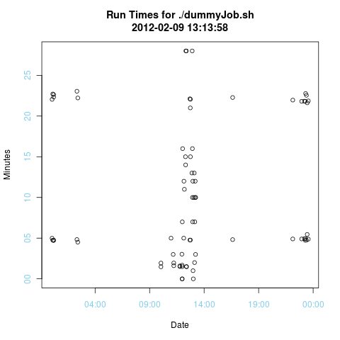

A wrapper around a shell script to produce a graph of runtimes.
===============================================================
2012/02/09

This script has been tested on ubuntu, debian and Windows7.

You will need R installed:
  sudo apt-get install r-base

Invoke with:
 ./timeRun.sh dummyJob.sh

